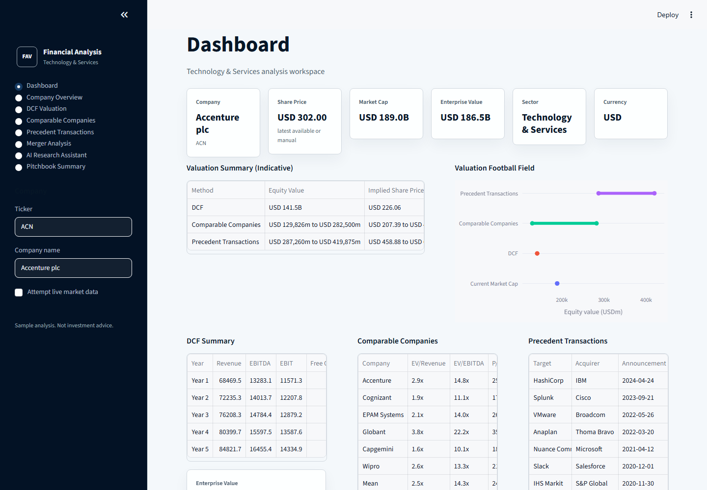
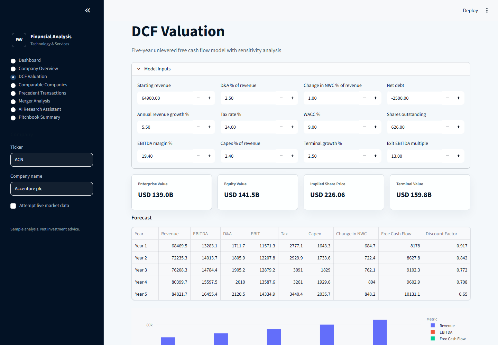
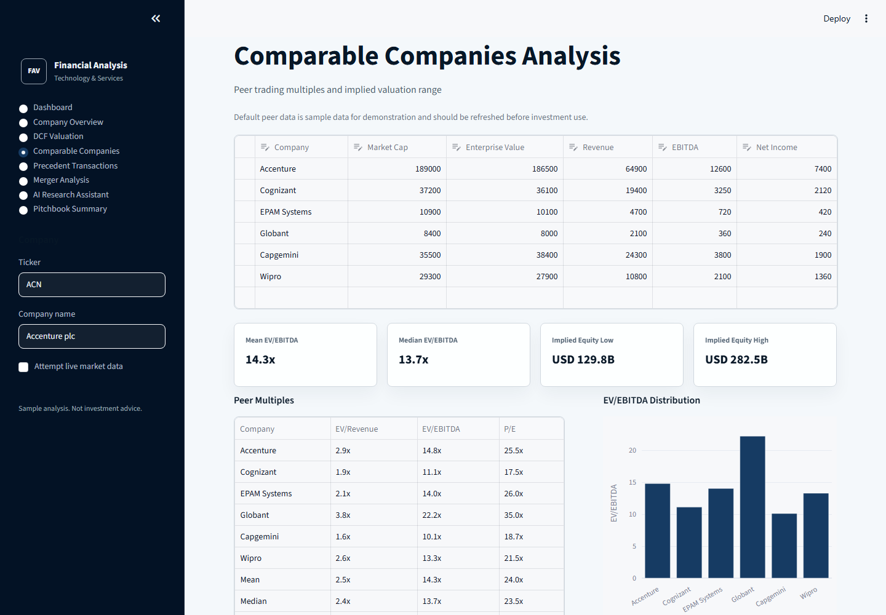
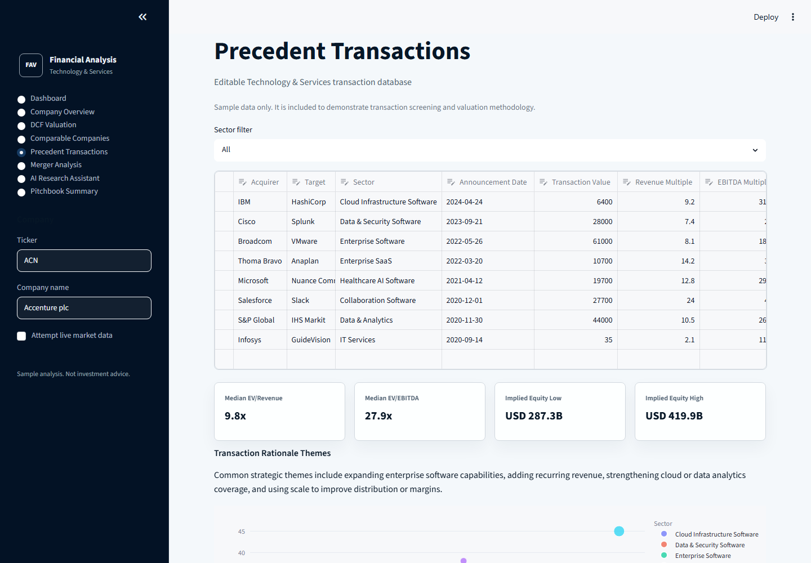
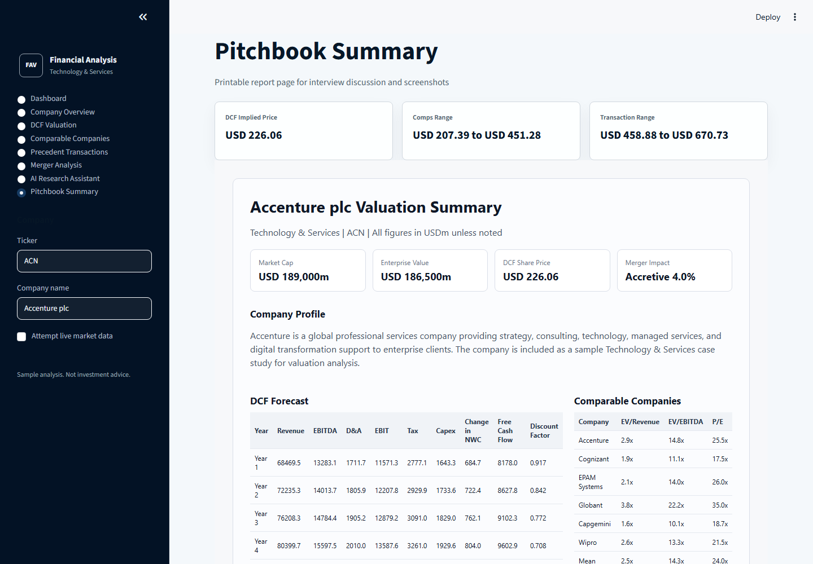

# Financial Analysis & Valuation Platform

A Streamlit-based corporate finance project for investment banking recruiting, focused on Technology & Services valuation, M&A analysis, and pitchbook-style outputs.

The app is designed to look like a credible graduate-built analytical platform: clean sidebar navigation, summary metric cards, dense but readable tables, practical valuation outputs, and simple charts.

## Modules

- **Company Overview**: Enter a ticker or company name, attempt optional live market data, and manually edit missing financial metrics.
- **DCF Valuation**: Five-year unlevered FCF model with revenue, EBITDA, EBIT, tax, capex, working capital, terminal value, enterprise value, equity value, and implied share price.
- **Sensitivity Analysis**: WACC vs terminal growth and exit EBITDA multiple vs WACC.
- **Comparable Companies**: Editable peer table with EV/Revenue, EV/EBITDA, P/E, summary statistics, and implied valuation range.
- **Precedent Transactions**: Editable sample Technology & Services transaction database with transaction multiples, filtering, rationale, and implied valuation range.
- **Merger Model**: Accretion-dilution analysis using acquisition financing mix, interest cost, tax, synergies, and new shares issued.
- **Research Assistant**: Deterministic template-based corporate finance assistant for investment highlights, risks, sector backdrop, acquisition rationale, valuation summary, and banker questions.
- **Pitchbook Summary**: Printable HTML report with valuation summary, DCF, comps, precedents, strategic rationale, and risks.

## Quick Start

```bash
python -m venv .venv
.\.venv\Scripts\Activate.ps1
pip install -r requirements.txt
streamlit run app.py
```

If you are using macOS or Linux:

```bash
python -m venv .venv
source .venv/bin/activate
pip install -r requirements.txt
streamlit run app.py
```

## Data Notes and Limitations

- The default company, peers, and precedent transactions are sample data for demonstration.
- Optional live market data uses `yfinance`, which can be incomplete, delayed, unavailable, or inconsistent by ticker.
- The model is educational and should not be used as investment advice.
- DCF assumptions are simplified and use percentage-of-revenue inputs for D&A, capex, and working capital.
- The merger model is a high-level accretion-dilution view and does not include purchase accounting, amortization of intangibles, transaction fees, or detailed balance sheet adjustments.

## Screenshots

### Dashboard



### DCF Valuation



### Comparable Companies



### Precedent Transactions



### Pitchbook Summary



## Future Improvements

- Add proper financial statement import from Excel.
- Add segment-level revenue and margin forecasting.
- Add scenario manager for base, upside, and downside cases.
- Add PowerPoint export for pitchbook pages.
- Add transaction fee, purchase accounting, and amortization schedules to the merger model.
- Add better ticker search and source reconciliation.
- Add saved cases by company.
